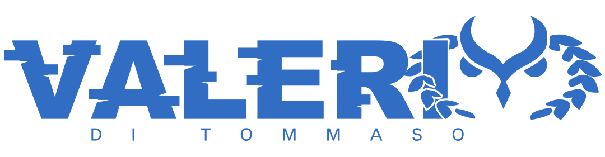

## Hi! I'm Valerio, a 20yo italian guy who is currently studying computer science at the University of Perugia.
Thats not the only thing that I have to share with the world about me. For example, I prefer to study alone and outside of the university settings of doing things in an exact way.

I to understand and work with:
- Python (My first ever language and main)
- HTML
- CSS
- PHP (why those dollars... WHYYY!!?)
- MySQL
- C (The best)
- Java (Smells like shi-)
- Dart & ~Flutter~ (Tried, I learned Dart but dropped Flutter after a while for the verbosity)
- Cloudflare Pages

I'm planning to learn in the future:
- Rust (The most important goal at the moment)
- Tauri (Only after learning Rust)
- React or Solid (I don't like web development... but I must do it)
- LlamaIndex and LangChain (Python frameworks to build AI agentic chains)
- Mojo (I'm waiting to see how it will grow)
- Godot Engine (Best open-source 2D engine?)
- Go (It seem an interesting language)

**Disclaimer:**
I use AI generative in programming only to learn and understand what's new to me, because I feel necessary to understand really everything about what I'm doing and I want to do.
The concepts and the architectures of my project will always be mine, unless I happen to specify otherwise.

### If you want to discover more about me, visit my website: [valerioditommaso.dev](https://valerioditommaso.dev/en)
